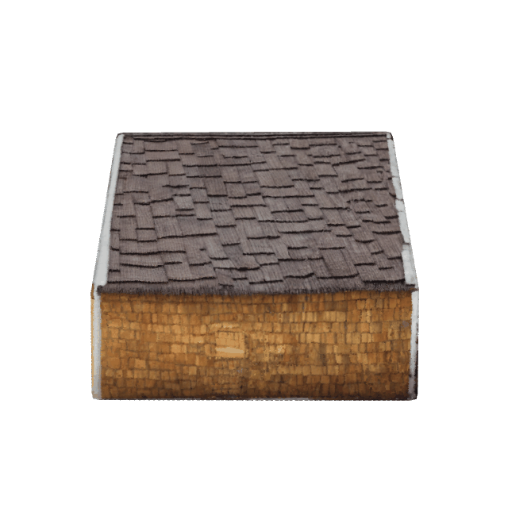

# Obj2Gif
An easy Python tool (tested on Python 3.7) to render GIF (from 360 degrees) from Obj files based on [trimesh](https://github.com/mikedh/trimesh) and [pyrender](https://github.com/mmatl/pyrender). Allow selecting the camera pose of the first rendered image and the light intensity interactively. 

Before using it, run:
```
pip install numpy pyrender trimesh imageio scikit-image
```

The input parameters and descriptions can be found in the `init_args()` function. To change the camera pose in the viewer, see [viewer controls](https://github.com/mmatl/pyrender?tab=readme-ov-file#viewer-keyboard-and-mouse-controls). 

Below are two GIF examples:
<p align="center"> </p>
